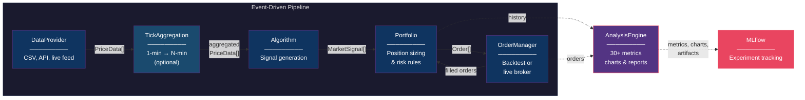

# Trading Guy

A modular, event-driven trading framework for backtesting and live trading. Define a strategy by subclassing **Algorithm** and **Portfolio**, then run it — or optimize thousands of parameter combinations in parallel with [Ray Tune](https://docs.ray.io/en/latest/tune/index.html) and track every result in [MLflow](https://mlflow.org/).

---

## Architecture



| Component | Responsibility |
|---|---|
| **DataProvider** | Loads market data, yields `PriceData` ticks grouped by timestamp |
| **TickAggregationPassthroughEngine** | Optional middleware — folds raw 1-min bars into N-min bars before the algorithm |
| **Algorithm** | Receives ticks + price history, emits `MarketSignal` objects (BUY / SELL) |
| **Portfolio** | Converts signals into `Order` objects based on cash, positions, and risk rules |
| **OrderManager** | Executes orders — `BacktestingOM` fills instantly; `AlpacaOM` routes to a live broker |
| **AnalysisEngine** | Extracts trades, computes 30+ metrics, generates charts, logs to MLflow |

---

## Running

All modes are driven by `run.py` with a config file:

```bash
# Backtest
python run.py backtest --config configs/example_backtest.yaml

# Backtest with tick aggregation (1-min data → 5-min bars)
python run.py backtest --config configs/example_backtest_agg.yaml

# Live trading (Alpaca)
python run.py live --config configs/example_live_spy_trend_macd.yaml

# Live with tick aggregation (raw 1-min Alpaca bars → N-min bars)
python run.py live --config configs/example_live_spy_trend_macd_agg.yaml

# Live with background self-optimization
python run.py live --config configs/example_live_self_optimizing.yaml

# Walk-forward backtest (rolling HPO + out-of-sample)
python run.py walk-forward --config configs/example_walk_forward.yaml

# Standalone hyperparameter optimization
python run.py hpo --config configs/example_hpo.yaml
```

Common overrides work on any mode:

```bash
python run.py backtest --config configs/example_backtest.yaml \
  --cash 50000 --run-name "my-run" --no-mlflow

# Override aggregation period without editing the config file
python run.py backtest --config configs/example_backtest_agg.yaml --agg-period 10
python run.py live    --config configs/example_live_spy_trend_macd_agg.yaml --agg-period 3
```

| Flag | Description |
|---|---|
| `--config` | YAML config profile (required) |
| `--cash` | Override starting cash |
| `--symbol` | Override trading symbol |
| `--no-mlflow` | Disable MLflow logging |
| `--run-name` | Override MLflow run name |
| `--agg-period N` | Set aggregation bar size in minutes (also enables aggregation) |
| `--data` | Override data file path (backtest / walk-forward / hpo) |
| `--session-id` | MongoDB session ID for state persistence |

---

## Tick Aggregation

Feed high-frequency (e.g. 1-min) data through the pipeline while the algorithm trades on coarser (e.g. 5-min) bars — without preprocessing the CSV or changing the strategy code.

Add an `aggregation:` section to any config:

```yaml
aggregation:
  enabled: true
  aggregation_period_minutes: 5   # 1, 3, 5, 10, 15, …
  use_market_open: true           # align windows to 9:30 market open
  market_open_hour: 9
  market_open_minute: 30
```

Or activate on the command line without editing the config:

```bash
python run.py backtest --config configs/example_backtest_agg.yaml --agg-period 10
```

**How it works:**
Each raw 1-min tick is accumulated inside the `TickAggregationPassthroughEngine`. When the window closes (e.g. at 9:35), it flushes a single aggregated bar (open=first, high=max, low=min, close=last, volume=sum, timestamp=window-end) to the downstream engine. The algorithm only ever sees the aggregated bars.

**Sweep over periods** (`scratch/run_agg_sweep.py`):

```bash
python scratch/run_agg_sweep.py                          # default: 1 3 5 10 15 min
python scratch/run_agg_sweep.py --periods 5 10 15 30     # custom periods
python scratch/run_agg_sweep.py --no-mlflow              # skip MLflow logging
```

Logs one MLflow run per period under the `"Aggregation Sweep"` experiment and prints a comparison table.

---

## Writing a Strategy

Subclass two classes and implement one method each.

**Algorithm** — emit signals from price data:

```python
from trading.core.algorithm import Algorithm
from trading.core.classes import PriceData, MarketSignal, SignalType

class SmaCrossover(Algorithm):
    def on_data_logic(self, data: list[PriceData]) -> list[MarketSignal]:
        prices = list(self.price_history["SPY"])
        if len(prices) < 20:
            return []
        if sum(prices[-5:]) / 5 > sum(prices[-20:]) / 20:
            return [MarketSignal(type=SignalType.BUY, symbol="SPY", strength=75)]
        return [MarketSignal(type=SignalType.SELL, symbol="SPY", strength=75)]
```

**Portfolio** — turn signals into orders:

```python
from trading.core.portfolio import Portfolio
from trading.core.classes import MarketSignal, PriceData, BracketOrder, TickResults, SignalType

class MyPortfolio(Portfolio):
    def process_tick_market_signals_logic(
            self, signals: list[MarketSignal], tick: list[PriceData]) -> TickResults:
        signal = next((s for s in signals if s.symbol == "SPY"), None)
        price  = self.get_price("SPY", tick)
        if not signal or not price:
            return TickResults(orders=[])
        if signal.type == SignalType.BUY and self.cash >= price:
            qty = int(self.cash / price)
            return TickResults(orders=[BracketOrder.create_bracket_order(
                "SPY", price * 1.06, price * 0.97, qty, 0.0, tick
            )])
        return TickResults(orders=[])
```

Then point a config file at them:

```yaml
algorithm:
  algorithm: "my_strategies.sma.SmaCrossover"
  history_length: 20

portfolio:
  portfolio: "my_strategies.sma.MyPortfolio"
  cash: 100000
  keep_history: true

data_provider:
  provider: "trading.data_providers.test_data_provider.TestDataProvider"
  path: "data/SPY_1min.csv"

order_manager:
  order_manager: "trading.core.om.backtesting_om.BacktestingOrderManager"

aggregation:
  enabled: true
  aggregation_period_minutes: 5

analysis:
  enabled: true
  log_to_mlflow: true
  experiment_name: "SMA Tests"
  run_name: "SMA 5/20 on 5-min bars"
```

```bash
python run.py backtest --config my_config.yaml
```

---

## Orders

- **Market** — fills at current price
- **Bracket** — entry + attached stop-loss + profit-taker; when one child triggers the other is canceled

```
PENDING → FILLED           (market order)
PENDING → PENDING_SALE     (bracket entry filled, awaiting child)
        → FILLED           (stop or profit triggered)
        → CANCELED         (sibling triggered first)
```

---

## Analysis

After a backtest, analysis runs automatically if `analysis.enabled: true` in the config.
All config params are logged as MLflow parameters automatically.

For post-mortem analysis of a live session stored in MongoDB:

```python
from trading.analysis.portfolio_analyzer import PortfolioAnalyzer

# Single session (connection from config.yaml state_store section)
analyzer = PortfolioAnalyzer.from_mongodb("your-session-uuid")
analyzer.run_analysis(output_dir="output/session_abc")

# Multiple sessions merged (bot restarted)
analyzer = PortfolioAnalyzer.from_mongodb_multi(["sid1", "sid2"])
analyzer.run_full_analysis(log_to_mlflow=True, run_name="Combined")
```

**Metrics:** total return, Sharpe, Sortino, max drawdown, win rate, profit factor, Calmar, Ulcer index, bracket effectiveness, and 20+ more.

---

## Directory Structure

```
trading/
  core/
    algorithm.py              # Algorithm base (subclass this)
    portfolio.py              # Portfolio base (subclass this)
    classes.py                # PriceData, MarketSignal, Order, BracketOrder
    pf/                       # Portfolio implementations
    om/                       # OrderManager implementations
  algorithms/                 # Built-in strategies (SpyTrendMACDAlgorithm, ...)
  analysis/
    analysis_engine.py        # 30+ metrics, charts, MLflow
    portfolio_analyzer.py     # Drop-in alternative; adds from_mongodb()
  data_providers/             # CSV, Alpaca, base class
  engines/
    backtest_engine.py        # Synchronous backtesting engine
    alpaca_engine.py          # Alpaca live trading (_agg_engine / _run_pipeline)
    tick_aggregation_passthrough_engine.py  # Fold raw ticks into N-min bars
    walk_forward_engine.py    # Rolling HPO + out-of-sample
    self_optimizing_live_engine.py  # Live + background HPO
configs/
  example_backtest.yaml
  example_backtest_agg.yaml            # Backtest with 1-min data + aggregation
  example_live_spy_trend_macd.yaml
  example_live_spy_trend_macd_agg.yaml # Live MACD + aggregation
  example_live_self_optimizing.yaml
  example_walk_forward.yaml
  example_hpo.yaml
utils/
  config_manager.py           # Singleton YAML config loader
  trading_state_store.py      # MongoDB session persistence
  mlflow_client.py            # MLflow tracking client
  utils.py                    # Helpers
scratch/
  run_agg_sweep.py            # Sweep aggregation periods, log to MLflow
run.py                        # Main entry point (backtest / live / hpo / walk-forward)
data/                         # Market data CSV files
```

---

## Further Reading

- [Alpaca Live Trading Setup](docs/ALPACA_SETUP.md)
- [Remote Ray Cluster Setup](docs/REMOTE_RAY_SETUP.md)
- [MLflow Experiment Tracking](docs/README_MLFLOW.md)
- [Technical Indicators](docs/TECHNICAL_INDICATORS.md)
- [Interactive Charts](docs/INTERACTIVE_CHART_README.md)
