# Trading Guy

A modular, event-driven trading backtesting and live-trading framework for Python. Subclass two classes — **Algorithm** and **Portfolio** — to define a strategy, then run thousands of parameter combinations in parallel with [Ray Tune](https://docs.ray.io/en/latest/tune/index.html) and track every result in [MLflow](https://mlflow.org/).

---

## Architecture

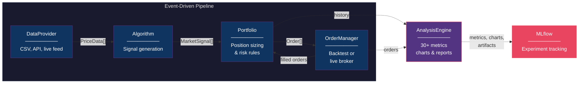

Each component is independent and swappable. Configure or replace any piece without touching the others.

### Component Summary

| Component | Responsibility |
|---|---|
| **DataProvider** | Loads market data and yields `PriceData` ticks grouped by timestamp. Ships with a CSV reader; subclass for other sources. |
| **Algorithm** | Receives ticks + price history, emits `MarketSignal` objects (BUY / SELL with strength and metadata). |
| **Portfolio** | Converts signals into `Order` objects based on cash, positions, and risk rules. |
| **OrderManager** | Executes orders against a backend — `BacktestingOM` fills instantly; `AlpacaOM` routes to a live broker. |
| **BacktestingEngine** | Drives the tick loop: DataProvider &#8594; Algorithm &#8594; Portfolio &#8594; OrderManager. |
| **AnalysisEngine** | Extracts trades, computes 30+ metrics, generates charts, and logs everything to MLflow. |

### How the Tick Loop Works

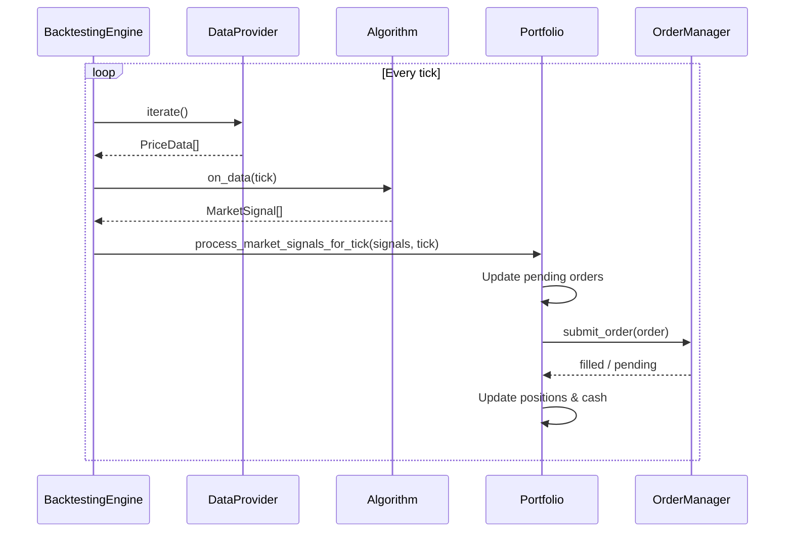

---

## Order Types and Lifecycle

### Supported Order Types

- **Market** — immediate execution at current price
- **Bracket** — entry order with attached stop-loss and profit-taker (when one child triggers, the other is canceled)

```python
# Market order
order = Order.create_market_order("SPY", OrderAction.BUY, 100, 0.0, tick)

# Bracket order: buy at market, stop-loss at -3%, take-profit at +6%
bracket = BracketOrder.create_bracket_order(
    "SPY", price * 1.06, price * 0.97, quantity, 0.0, tick
)
```

### Order State Machine

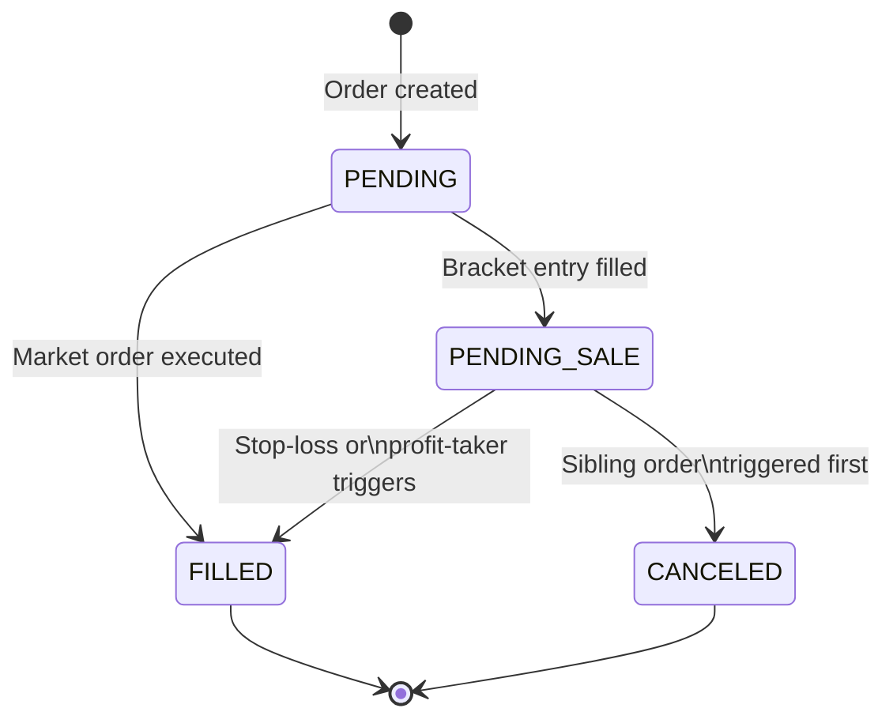

---

## Usage

You only need to do two things to test a new strategy:

1. **Subclass `Algorithm`** — implement `on_data_logic()` with your signal generation logic
2. **Subclass `Portfolio`** — implement `process_tick_market_signals_logic()` with your order creation logic

Everything else (data loading, order execution, history tracking, performance analysis) is handled by the framework.

### Step 1 — Write an Algorithm

Override `on_data_logic()`. It receives the current tick and returns a list of signals.

```python
from trading.core.algorithm import Algorithm
from trading.core.classes import PriceData, MarketSignal, SignalType


class SmaCrossover(Algorithm):
    def on_data_logic(self, data: list[PriceData]) -> list[MarketSignal]:
        signals = []
        for pd in data:
            if len(self.price_history[pd.symbol]) < 20:
                continue

            prices = list(self.price_history[pd.symbol])
            sma_short = sum(prices[-5:]) / 5
            sma_long = sum(prices[-20:]) / 20

            if sma_short > sma_long:
                signals.append(MarketSignal(
                    type=SignalType.BUY, symbol=pd.symbol, strength=75
                ))
            elif sma_short < sma_long:
                signals.append(MarketSignal(
                    type=SignalType.SELL, symbol=pd.symbol, strength=75
                ))
        return signals
```

The base class automatically tracks price history in `self.price_history[symbol]` (deque of closing prices) and `self.price_data_history[symbol]` (deque of full `PriceData` objects). Set the window size via `history_length` in config.

### Step 2 — Write a Portfolio

Override `process_tick_market_signals_logic()`. It receives signals and the current tick, returns `TickResults` containing orders.

```python
from trading.core.portfolio import Portfolio
from trading.core.classes import (MarketSignal, PriceData, Order, OrderAction,
                                   SignalType, BracketOrder, TickResults)
from utils.utils import find_marketsignal_in_list, find_pricedata_in_list


class MyPortfolio(Portfolio):
    def process_tick_market_signals_logic(
            self, signals: list[MarketSignal],
            tick: list[PriceData]) -> TickResults:

        symbol = self.cfg['symbol']
        signal = find_marketsignal_in_list(symbol, signals)
        pd = find_pricedata_in_list(symbol, tick)

        if pd is None or signal is None:
            return TickResults(orders=[])

        if signal.type == SignalType.BUY:
            quantity = int(self.cash / pd.close)
            order = BracketOrder.create_bracket_order(
                symbol, pd.close * 1.06, pd.close * 0.97,
                quantity, 0.0, tick
            )
            return TickResults(orders=[order])

        elif signal.type == SignalType.SELL and symbol in self.positions:
            order = Order.create_market_order(
                symbol, OrderAction.SELL,
                self.positions[symbol].quantity, 0.0, tick
            )
            return TickResults(orders=[order])

        return TickResults(orders=[])
```

### Step 3 — Run a Backtest

```python
from trading.engines.backtest_engine import BacktestingEngine
from trading.core.om.backtesting_om import BacktestingOM
from trading.data_providers.test_data_provider import TestDataProvider
from trading.analysis.analysis_engine import AnalysisEngine

# Wire components
om = BacktestingOM()
pf = MyPortfolio({"symbol": "SPY", "cash": 100000}, om, 100000, {}, True)
algo = SmaCrossover({"history_length": 20})
dp = TestDataProvider({"path": "data/SPY_5min.csv"})

# Run
engine = BacktestingEngine({}, dp, algo, om, pf)
engine.run()

# Analyze
analysis = AnalysisEngine(pf, om)
results = analysis.run_full_analysis(
    experiment_name="SMA Tests",
    run_name="SMA 5/20 Crossover",
    description="Testing 5/20 SMA crossover on SPY",
    parameters={"sma_short": 5, "sma_long": 20},
    log_to_mlflow=True,
)

print(f"Return: {results['metrics'].total_return_pct:.2f}%")
print(f"Sharpe: {results['metrics'].sharpe_ratio:.2f}")
print(f"Max Drawdown: {results['metrics'].max_drawdown_pct:.2f}%")
```

---

## Parallel Optimization with Ray Tune

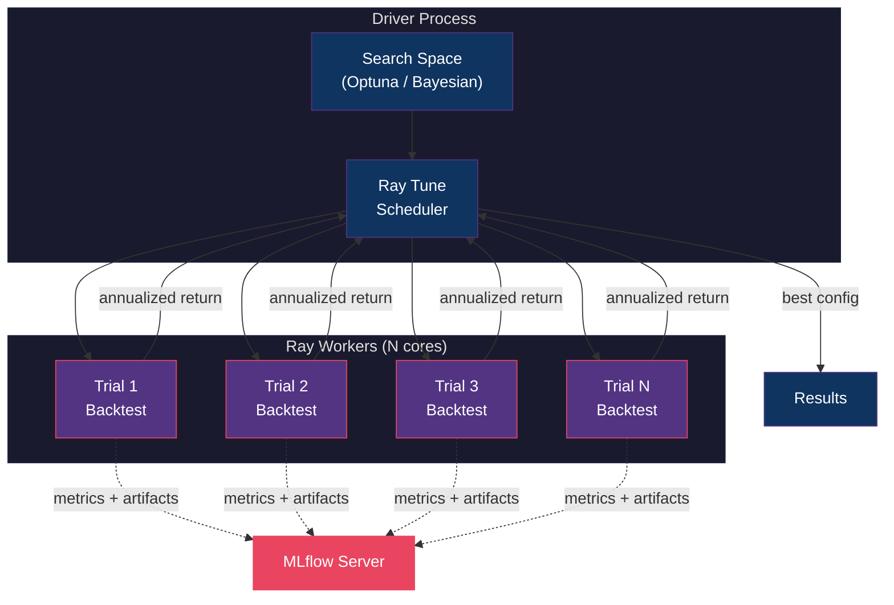

Define a search space and let Ray Tune + Optuna find optimal parameters:

```python
from ray import tune
from trading.backtesting.run_backtest_ray import tune_backtest_hyperparameters

best_config = tune_backtest_hyperparameters(
    symbol="SPY",
    algorithm_class=SmaCrossover,
    portfolio_class=MyPortfolio,
    data_provider_class=TestDataProvider,
    order_manager_class=BacktestingOM,

    base_algorithm_config={},
    base_portfolio_config={"symbol": "SPY"},
    base_data_provider_config={"path": "data/SPY_5min.csv"},
    base_backtest_config={
        "symbol": "SPY",
        "starting_cash": 1000.0,
        "run_name": "SMA_HPO",
        "description": "SMA Crossover Optimization",
        "experiment_name": "SMA Optimization"
    },

    search_space={
        "history_length": tune.randint(10, 100),
        "stop_pct": tune.uniform(1.0, 15.0),
        "profit_pct": tune.uniform(1.0, 20.0),
    },

    algorithm_param_keys=["history_length"],
    portfolio_param_keys=["stop_pct", "profit_pct"],

    num_samples=500,
    max_concurrent_trials=8,
)
```

Each trial runs a full backtest, logs results to MLflow, and reports the annualized return to the Optuna optimizer for the next sample.

### Remote Ray Cluster

```bash
python run_remote_ray.py --ray-address ray://192.168.1.100:10001 --samples 5000
```

---

## Analysis and Reports

The `AnalysisEngine` computes 30+ metrics, generates visualizations, and logs everything to MLflow.

```python
analysis = AnalysisEngine(portfolio, order_manager)
metrics = analysis.calculate_metrics()
analysis.plot_equity_curve(save_path="equity_curve.png")
analysis.plot_comprehensive_dashboard(save_path="dashboard.png")
analysis.plot_interactive_portfolio()   # Interactive Plotly chart
report = analysis.generate_report()
```

**Metrics include:** total return, annualized return, Sharpe ratio, Sortino ratio, max drawdown, win rate, profit factor, average trade P&L, volatility, skewness, kurtosis, Calmar ratio, Ulcer index, bracket order effectiveness, and more.

### Example Outputs

| Equity Curve | Drawdown |
|:---:|:---:|
| 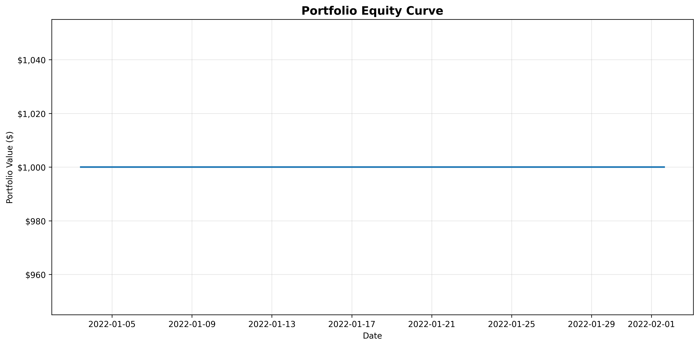 | 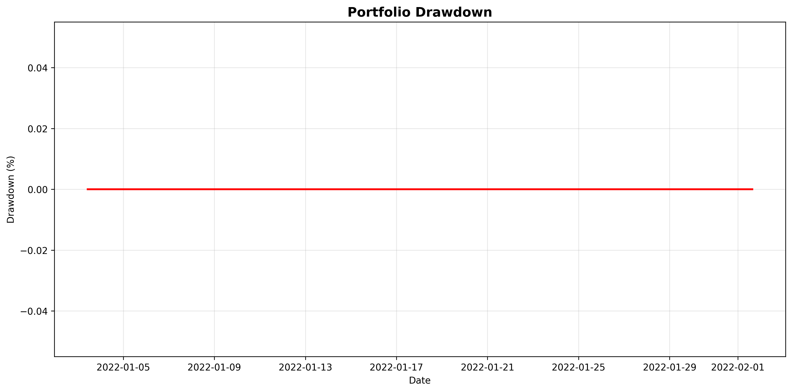 |

| Portfolio with Trades | Trade P&L |
|:---:|:---:|
| 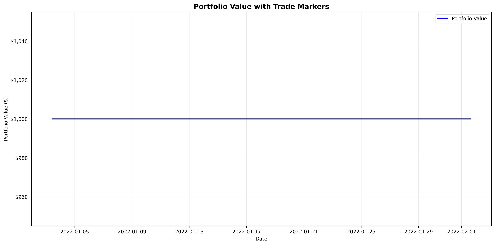 | 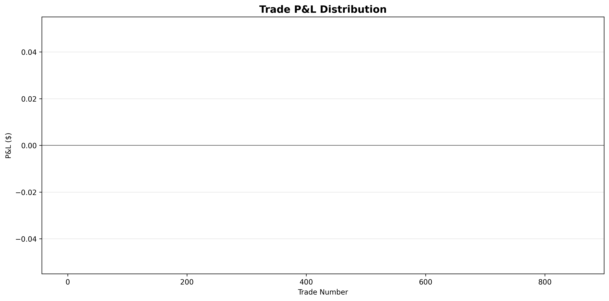 |

| Returns Distribution | Stock Performance |
|:---:|:---:|
| 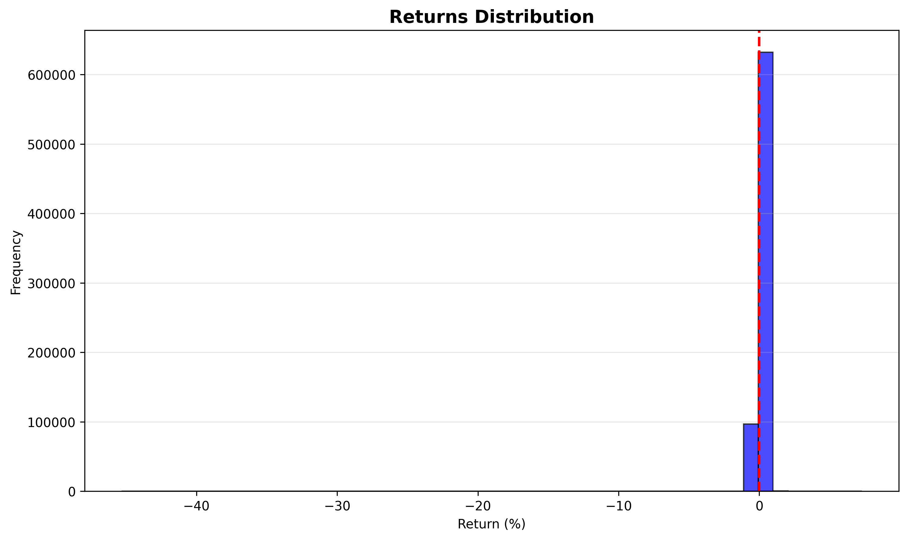 | 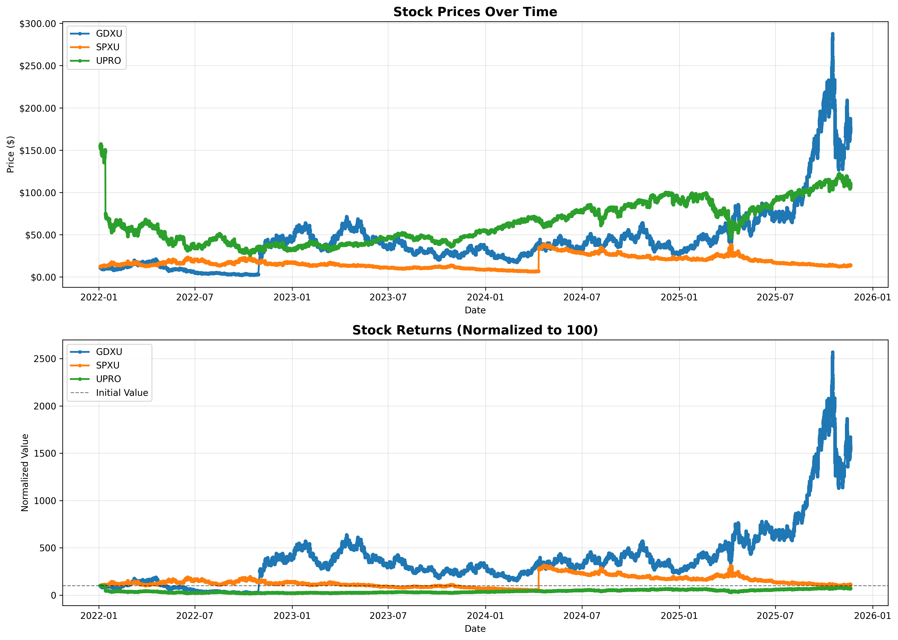 |

| Comprehensive Dashboard |
|:---:|
| 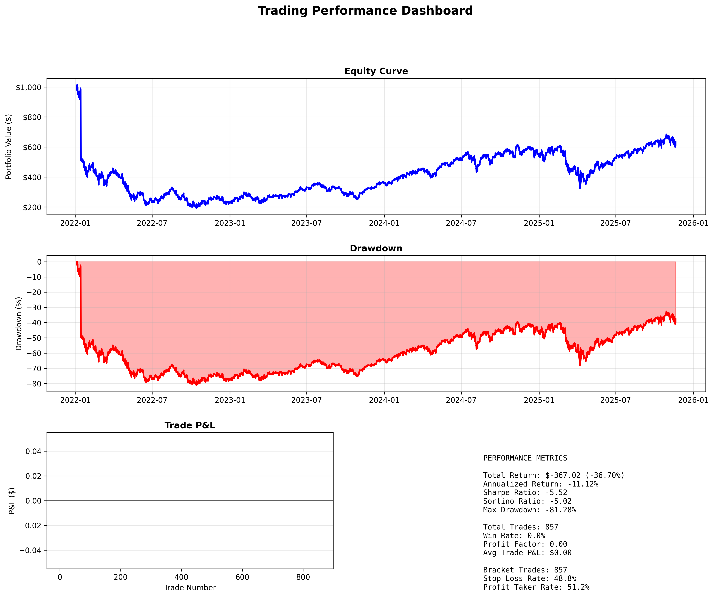 |

---

## Technical Analysis

Built-in indicators with no external dependencies (no TA-Lib required):

| Indicator | Description |
|---|---|
| **EMA** | Exponential Moving Average |
| **MACD** | Moving Average Convergence Divergence (histogram + signal line) |
| **RSI** | Relative Strength Index |

```python
from trading.core.ta.analyzer import TechnicalAnalyzer

ta = TechnicalAnalyzer(price_data_history)
macd = ta.get_macd(fast=12, slow=26, signal=9)
rsi = ta.get_rsi(period=14)
```

---

## Configuration

Components can be wired via `config.yaml` using dynamic class loading:

```yaml
logging:
  level: INFO
  console: true
  folder: "logs"
  filename: "trading.log"

mlflow:
  enabled: true
  tracking_uri: "http://localhost:8899"
  experiment_name: "Trading Backtest"

simulator:
  data_provider:
    provider: "data_providers.test_data_provider.TestDataProvider"
    path: "data/SPY_5min.csv"
  algorithm:
    algorithm: "core.algorithms.my_algorithm.SmaCrossover"
    history_length: 20
  order_manager:
    order_manager: "core.om.backtesting_om.BacktestingOM"
  portfolio:
    portfolio: "core.pf.my_portfolio.MyPortfolio"
    symbol: "SPY"
    cash: 100000
    keep_history: true
```

```python
engine = BacktestingEngine(cfg_section_to_use="simulator")
engine.run()
```

---

## Directory Structure

```
trading/
  core/
    algorithm.py                  # Algorithm base class (subclass this)
    portfolio.py                  # Portfolio base class (subclass this)
    classes.py                    # PriceData, MarketSignal, Order, Position, BracketOrder
    algorithms/                   # Strategy implementations
    pf/                           # Portfolio implementations
    om/                           # OrderManager implementations
    ta/                           # Technical analysis (EMA, MACD, RSI)
  data_providers/                 # CSV reader and base class
  engines/
    backtest_engine.py            # Main backtesting loop
    split_period_backtest_engine.py  # Train/validation split
    alpaca_engine.py              # Live trading with Alpaca
  backtesting/
    run_backtest_ray.py           # Ray Tune parallel optimization
    run_launchers.py              # Ready-made launcher functions
  analysis/
    analysis_engine.py            # Metrics, charts, MLflow integration
utils/
  config_manager.py               # Singleton YAML config loader
  logger.py                       # Singleton logger
  mlflow_client.py                # MLflow experiment tracking
  utils.py                        # Helpers
tests/                            # Unit and integration tests
data/                             # Market data CSV files
examples/                         # Example scripts and chart images
docs/                             # Setup guides
```

---

## Running Tests

```bash
pytest tests/                    # All tests
pytest tests/unit/ -v            # Unit tests with verbose output
pytest tests/ --cov=trading      # With coverage report
```

---

## Further Reading

- [Alpaca Live Trading Setup](docs/ALPACA_SETUP.md)
- [Remote Ray Cluster Setup](docs/REMOTE_RAY_SETUP.md)
- [MLflow Experiment Tracking](docs/README_MLFLOW.md)
- [Technical Indicator Details](docs/TECHNICAL_INDICATORS.md)
- [Interactive Charts](docs/INTERACTIVE_CHART_README.md)
- [Exception Handling Strategy](docs/EXCEPTION_HANDLING_STRATEGY.md)
